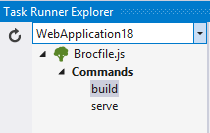
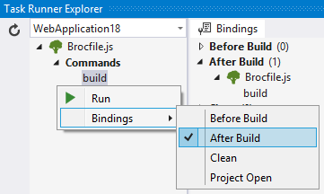

## Broccoli and Ember-CLI Task Runner extension

Adds support for [Broccoli](https://github.com/broccolijs/broccoli) in Visual Studio 2015's
Task Runner Explorer.

### Execute scripts

When Broccoli is specified, the Task Runner Explorer
will show those commands.

Each command can be executed by double-clicking the task.

### Bindings

Script bindings make it possible to associate individual scripts
with Visual Studio events such as "After build" etc.

